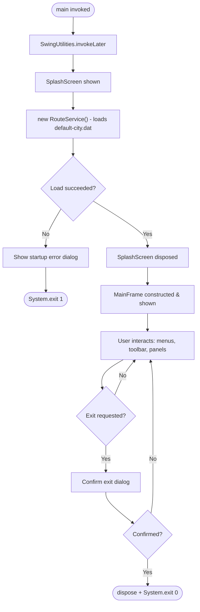
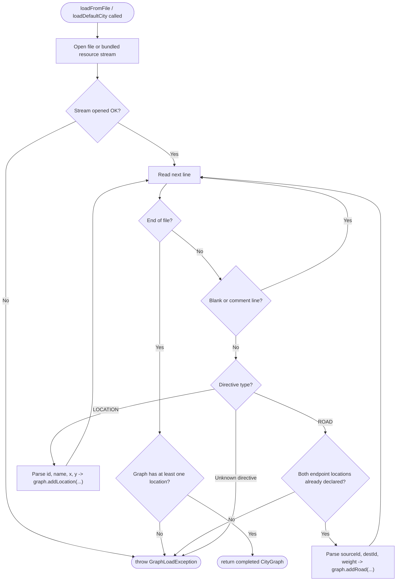
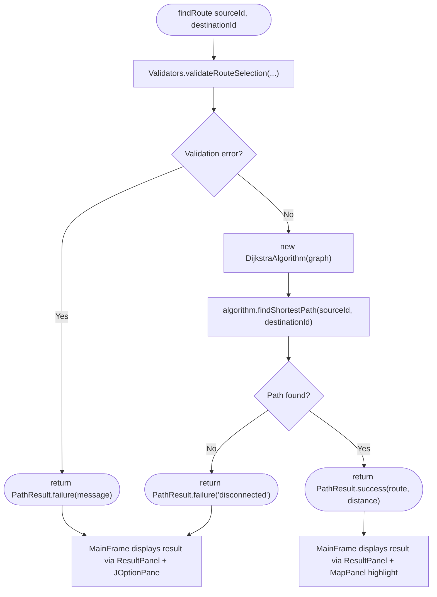
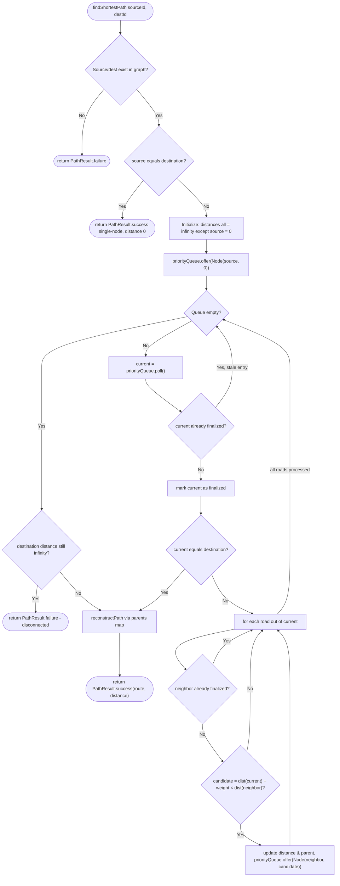
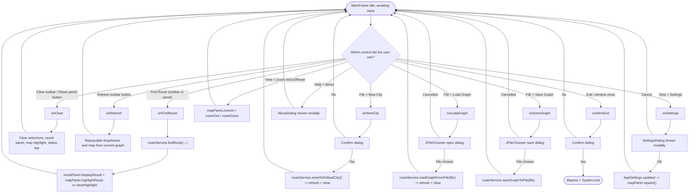

# Flowcharts

Five flowcharts as required by the project spec. `UML_DIAGRAMS.md`
already covers the end-to-end user workflow as an activity diagram;
these flowcharts each zoom into one specific process in more technical
detail.

## 1. Application Flow (lifecycle, launch to shutdown)

## 2. Graph Creation (GraphLoader parsing a data file)

## 3. Route Search (RouteService.findRoute)

## 4. Dijkstra's Algorithm (detailed)

## 5. GUI Workflow (event dispatch across MainFrame)

