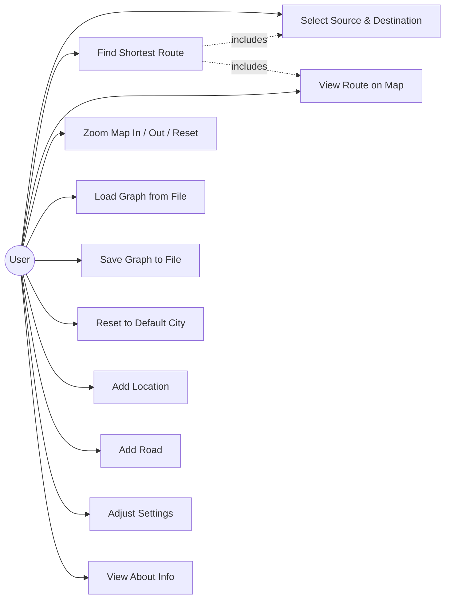
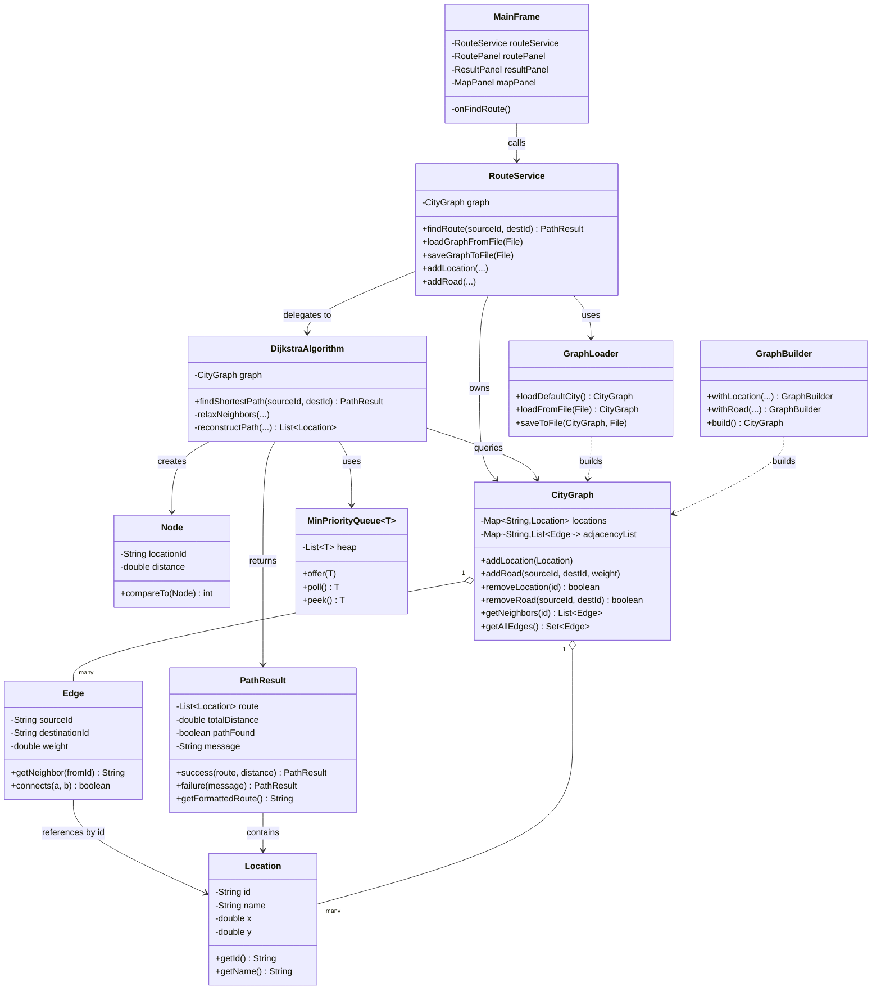
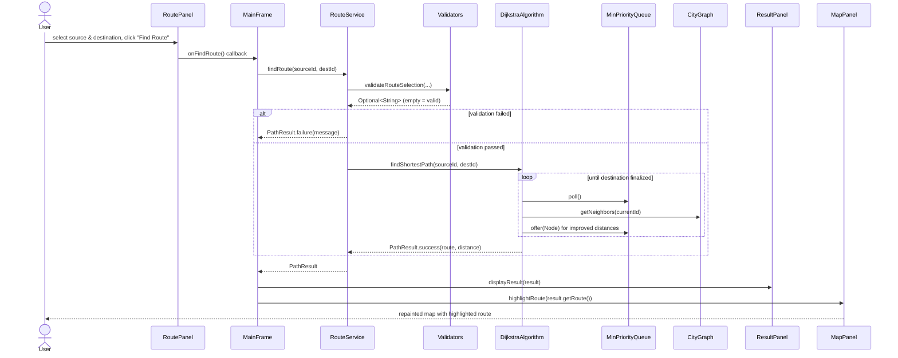
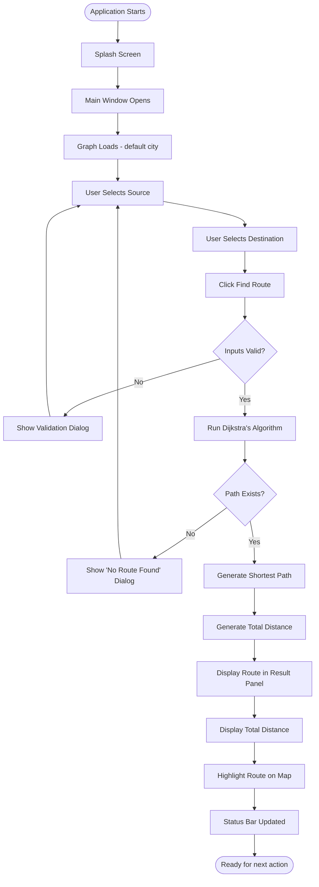
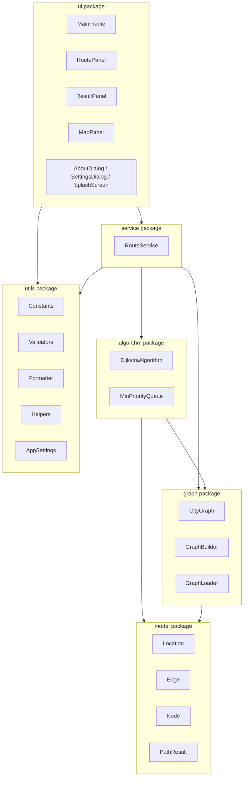

# UML Diagrams

All diagrams below are written in [Mermaid](https://mermaid.js.org/),
which GitHub renders natively in Markdown — no external image files or
diagramming tool required, and they stay easy to update alongside the code.

## 1. Use Case Diagram

## 2. Class Diagram (core classes)

The full project has 24 classes across six packages (see
`PROJECT_STRUCTURE.md` for the complete list); this diagram shows the
core pathfinding path to keep it readable.

## 3. Sequence Diagram — "Find Route" user action

## 4. Activity Diagram — application workflow

Mirrors the workflow defined in the project spec, from launch through
displaying a result.

## 5. Component Diagram — package dependencies

